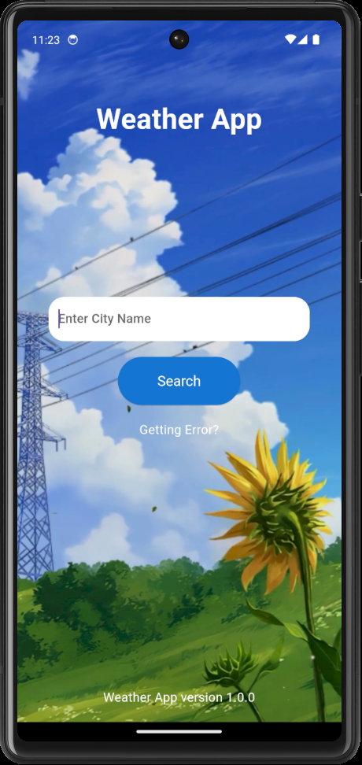
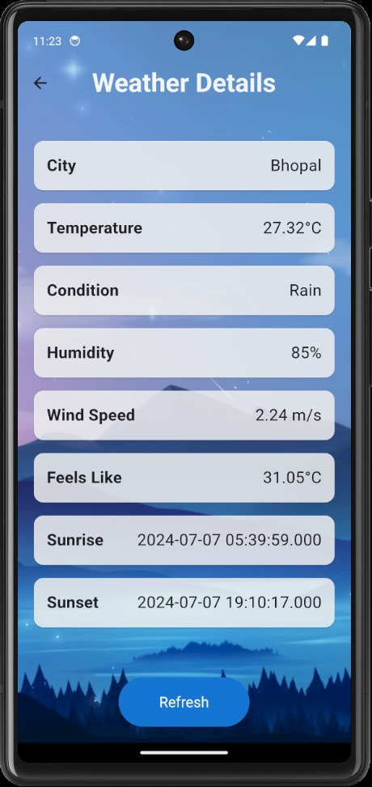

# Flutter Weather App

Welcome to the Flutter Weather App repository! This project is a simple yet visually appealing weather application built using Flutter. It fetches weather data from an API and displays it in an engaging interface with a video background.

## Features

- **Current Weather Information:** Displays city name, temperature, weather condition, humidity, wind speed, feels like temperature, sunrise, and sunset times.
- **Video Background:** Plays a looped video in the background for a visually engaging experience.
- **Refresh Button:** Updates the weather information for the last searched city.
- **Loading Indicator:** Displays a loading spinner while fetching new weather data.
- **Navigation:** Simple back button to navigate back to the home screen.

## Screenshots




## Getting Started

### Prerequisites

Before you begin, ensure you have met the following requirements:
- You have installed the latest version of [Flutter](https://flutter.dev/docs/get-started/install).
- You have a working internet connection.

### Installation

1. Clone this repository to your local machine:

```bash
git clone https://github.com/th3varun/weather_app.git
